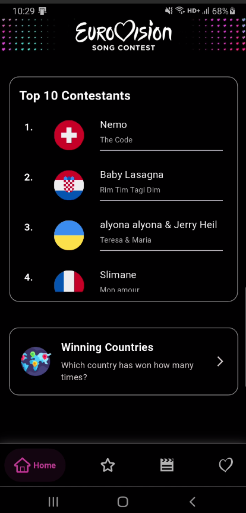
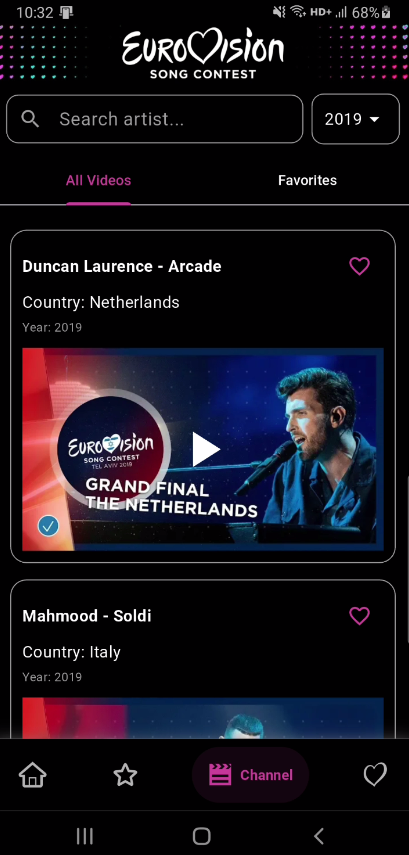
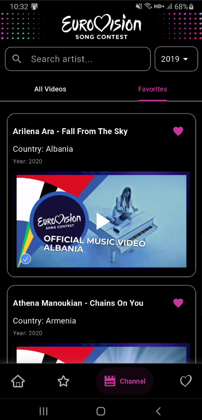
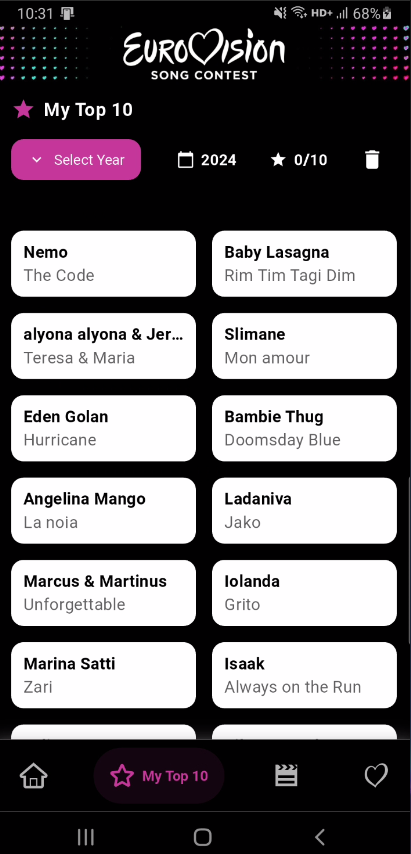
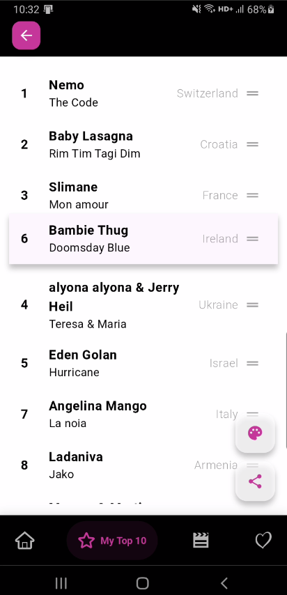
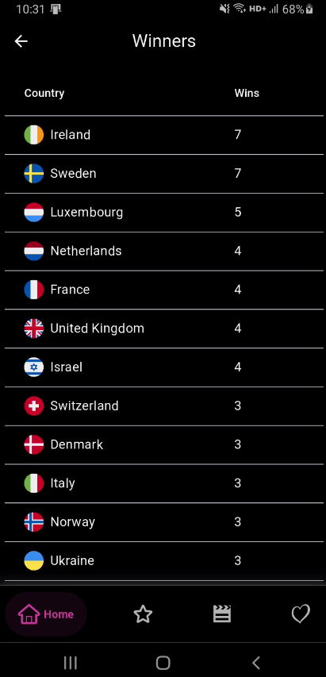
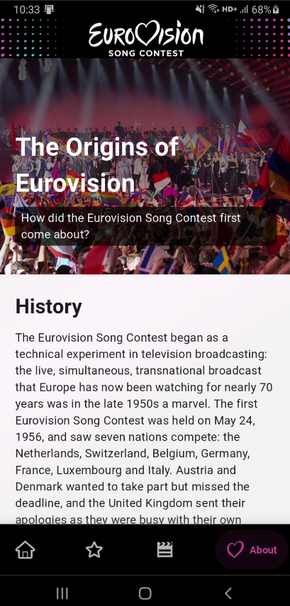

# Eurovision App 🎶


A modern Flutter application to explore, watch, and favorite Eurovision contest videos by year and artist.

---

## 🎥 Demo


---"

## 📸 Screenshots

| Home | Search | Favorites |
|:---:|:---:|:---:|
|  |  |  |

| My Top 10 | Reorder List | Winner Details |
|:---:|:---:|:---:|
|  |  |  |

| About |
|:---:|
|  |

---

## 👛 Project Structure

```bash
lib/
├── app/                            # App-specific layers and modules
│   ├── common/                     # Common utilities and shared components
│   │   ├── constants/              # App-wide constants (colors, strings, etc.)
│   │   ├── functions/              # Reusable helper functions
│   │   ├── service_locator/        # Dependency injection setup (e.g., get_it)
│   │   └── widgets/                # Shared custom widgets across the app
│   ├── features/                   # Feature-based architecture
│   │   ├── data/                   # Data layer (models, datasources, API access)
│   │   │   ├── datasources/        # Remote/local data fetching logic
│   │   │   ├── domain/             # Entities and use cases (if used)
│   │   │   ├── models/             # Data models for API parsing
│   │   ├── presentation/           # UI layer (views, providers, widgets)
│   │   │   ├── about/              # "About" screen of the app
│   │   │   ├── feature/            # Feature-specific settings (themes, language)
│   │   │   ├── home/               # Home screen
│   │   │   ├── home_detail/        # Detailed view for selected home item
│   │   │   ├── mytopten/           # "My Top 10" list and customization
│   │   │   ├── search_video/       # Video search and year filter features
│   │   │   ├── splash/             # App splash screen
│   └── utils/                      # Utility classes (e.g., year calculator)
├── core/                           # Core layer (cross-cutting concerns)
│   ├── config/                     # App configurations (e.g., environment setup)
│   ├── constants/                  # Global constants
│   ├── dio_manager/                # Dio API setup and management
│   ├── extensions/                 # Dart/Flutter extension methods
│   ├── helpers/                    # Helper logic and abstract classes
│   ├── keys/                       # Global keys (e.g., navigatorKey)
│   ├── logger/                     # Logging utilities
│   ├── network_control/           # Network state management
│   ├── providers/                  # Base provider classes and logic
│   ├── result/                     # Result pattern (success, error handling)
│   ├── routes/                     # Navigation routes and page transitions
│   └── widgets/                    # Core-level reusable widgets
├── main.dart                       # Application entry point
```

---

## ✨ Features

- Browse Eurovision contest videos by year
- Search artists by name
- Save and manage favorite videos
- Create and reorder your own "Top 10" list
- Watch videos through an embedded YouTube player
- Light and dark theme support
- State management with Provider
- API integration using Dio
- Local storage with Hive

---

## 🛠️ Installation

1. Clone the repository:
```bash
git clone https://github.com/denizguvel/eurovision-app.git
```

2. Navigate into the project directory:
```bash
cd eurovision-app
```

3. Install dependencies:
```bash
flutter pub get
```

4. Run the app:
```bash
flutter run
```

---

## 💪 Technologies Used

- Flutter 3.29.0
- Dart
- Provider (State Management)
- Dio (Networking)
- Hive (Local Storage)
- Youtube Player Flutter (Video Playback)
- Clean Architecture Principles

---

## 🔗 API

The application fetches data from the following Eurovision API:

```plaintext
https://eurovisionapi.runasp.net/api/
```

---

## 🤝 Contributing

Contributions, issues, and feature requests are welcome! 
Feel free to open an issue or submit a pull request. 🚀

---

## 📜 License

This project is licensed under the **MIT License**.

> You are free to use, modify, and distribute this project as long as proper credit is given. See the [LICENSE](LICENSE) file for more details.

---


# 👋 Thank You!
Enjoy exploring the world of Eurovision through this app! 🌟
